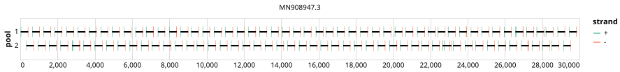

# test-artic 400bp v4.1.0


> If you use this scheme please cite: https://doi.org/10.1101%2F2020.09.04.283077

## Notes

Definition: https://github.com/pha4ge/primer-schemes/tree/main/sars-cov-2/artic/v4.1

Source: https://github.com/quick-lab/primerschemes/tree/main/primerschemes/artic-sars-cov-2/400/v4.1.0

## Metadata

**Target Organisms:**
- SARS-CoV-2 (Tax ID: 2697049)

**Derived from:** test-artic/400/v4.0.0

## Contributors

- ARTIC network
- Chris <chrisgkent@test.com> (ORCID: 123)
- Bede <Bede@test.com>

## Vendors

- IDT: 10011442
- Eurofins ([Website](https://eurofinsgenomics.com))

## Overviews

<div style="width: 100%;"></div>

## Details

```json
{
    "schema_version": "1.0.0-alpha",
    "primer_scheme_name": "test-artic",
    "amplicon_size": 400,
    "primer_scheme_version": "v4.1.0",
    "primer_scheme_identifier": "test-artic/400/v4.1.0",
    "primer_scheme_contributor": [
        {
            "primer_scheme_contributor_name": "ARTIC network"
        },
        {
            "primer_scheme_contributor_name": "Chris",
            "primer_scheme_contributor_orcid": "123",
            "primer_scheme_contributor_email": "chrisgkent@test.com"
        },
        {
            "primer_scheme_contributor_name": "Bede",
            "primer_scheme_contributor_email": "Bede@test.com"
        }
    ],
    "primer_scheme_target_organism": [
        {
            "primer_scheme_target_organism_name": "SARS-CoV-2",
            "primer_scheme_target_organism_ncbi_taxon_id": "2697049"
        }
    ],
    "primer_scheme_identifier_alias": [
        "ARTIC/V4.1"
    ],
    "primer_scheme_license": "CC-BY-SA-4.0",
    "primer_scheme_development_status": "DRAFT",
    "primer_scheme_derived_from": "test-artic/400/v4.0.0",
    "citation": [
        "https://doi.org/10.1101%2F2020.09.04.283077"
    ],
    "primer_scheme_details": [
        "Definition: https://github.com/pha4ge/primer-schemes/tree/main/sars-cov-2/artic/v4.1",
        "Source: https://github.com/quick-lab/primerschemes/tree/main/primerschemes/artic-sars-cov-2/400/v4.1.0"
    ],
    "primer_scheme_vendor": [
        {
            "primer_scheme_vendor_name": "IDT",
            "primer_scheme_vendor_kit_name": "10011442"
        },
        {
            "primer_scheme_vendor_name": "Eurofins",
            "primer_scheme_vendor_url": "https://eurofinsgenomics.com"
        }
    ],
    "primer_scheme_checksums": {
        "primer_scheme_sha256": "4c9d546713405d74a558ef50094e2bc3aaadc60644b3a16ce14a178d5d20284a",
        "reference_sequence_sha256": "b09a4a3d6824dc4a9f3a17d480f3335f73cb1507897f6dad0de871e8f00d8637"
    },
    "primer_scheme_creation_date": "2021-03-08",
    "primer_scheme_submission_date": "2026-07-24"
}
```


------------------------------------------------------------------------

This work is licensed under a [Creative Commons Attribution-ShareAlike 4.0 International License](http://creativecommons.org/licenses/by-sa/4.0/).

