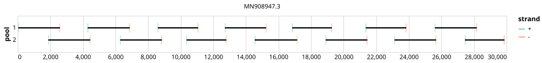

# test-eden 2500bp v1.0.0


> If you use this scheme please cite: https://dx.doi.org/10.17504/protocols.io.befyjbpw

## Notes

Protocol includes addendum for ONT sequencing

Definition: https://github.com/pha4ge/primer-schemes/blob/main/schemes/sars-cov-2/eden/2500/v1.0.0

## Metadata

**Target Organisms:**
- SARS-CoV-2 (Tax ID: 2697049)

## Contributors

- John-Sebastian Eden
- Eby Sim

## Overviews

<div style="width: 100%;"></div>

## Details

```json
{
    "schema_version": "1.0.0-alpha",
    "primer_scheme_name": "test-eden",
    "amplicon_size": 2500,
    "primer_scheme_version": "v1.0.0",
    "primer_scheme_identifier": "test-eden/2500/v1.0.0",
    "primer_scheme_contributor": [
        {
            "primer_scheme_contributor_name": "John-Sebastian Eden"
        },
        {
            "primer_scheme_contributor_name": "Eby Sim"
        }
    ],
    "primer_scheme_target_organism": [
        {
            "primer_scheme_target_organism_name": "SARS-CoV-2",
            "primer_scheme_target_organism_ncbi_taxon_id": "2697049"
        }
    ],
    "primer_scheme_identifier_alias": [
        "sydney"
    ],
    "primer_scheme_license": "CC-BY-4.0",
    "primer_scheme_development_status": "TESTED",
    "citation": [
        "https://dx.doi.org/10.17504/protocols.io.befyjbpw"
    ],
    "primer_scheme_details": [
        "Protocol includes addendum for ONT sequencing",
        "Definition: https://github.com/pha4ge/primer-schemes/blob/main/schemes/sars-cov-2/eden/2500/v1.0.0"
    ],
    "primer_scheme_checksums": {
        "primer_scheme_sha256": "3816cc533ef389761caedb13b9629a665fd9131af61227957c32289050067e4b",
        "reference_sequence_sha256": "b09a4a3d6824dc4a9f3a17d480f3335f73cb1507897f6dad0de871e8f00d8637"
    },
    "primer_scheme_creation_date": "2021-06-01",
    "primer_scheme_submission_date": "2026-07-24"
}
```


------------------------------------------------------------------------

This work is licensed under a [Creative Commons Attribution 4.0 International License](http://creativecommons.org/licenses/by/4.0/).

